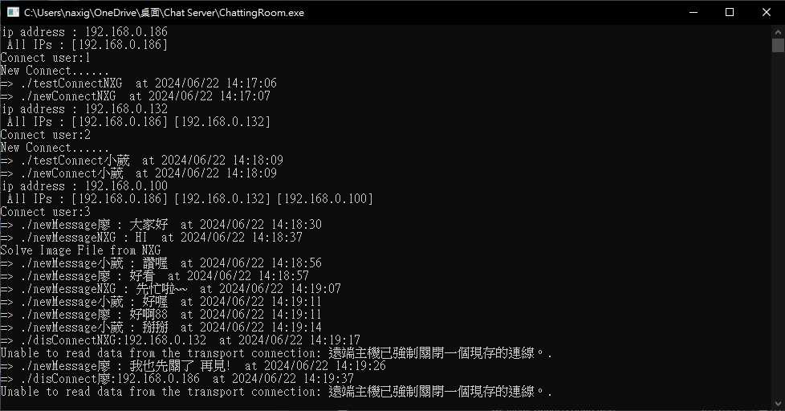
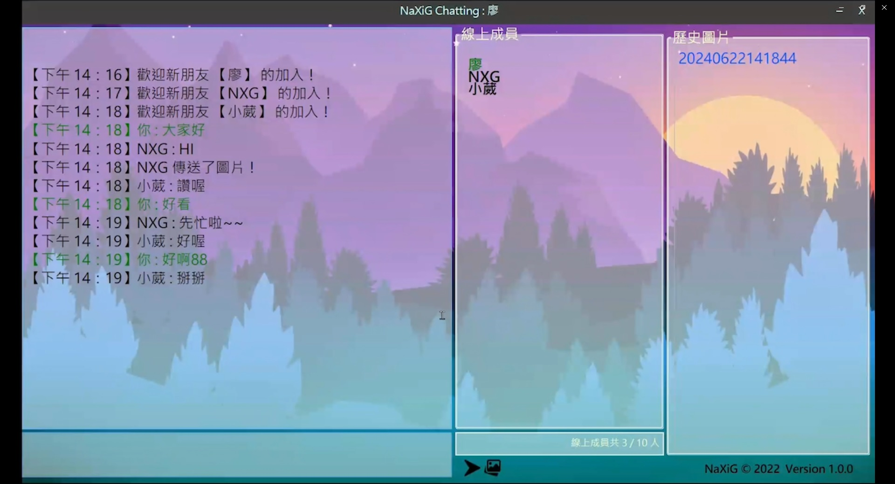

# C# WPF Chatting Room

本專案使用C# WPF製作。提供一個多人共同使用的聊天室，除了可以傳送文字訊息外，也能傳送圖片。

## 功能簡介

- **文字訊息**：可以發送一般文字訊息。
- **圖片訊息**：可以傳送圖片，使用的是Base64編碼/解碼。

## Release Application
- [Server](https://drive.google.com/drive/folders/1Q3qCcqho5Y6u8JhNAk6nkf32i4b2wY2Y?usp=sharing)
- [Client](https://drive.google.com/drive/folders/1lVobSSCxCCfEtwPa0m-HzWDc_LtXmrtc?usp=sharing)

## 如何使用

- 若使用虛擬IP(192.168.X.X)則客戶端需與Server位在同一網域中(Wi-Fi)。
- 若使用實體IP，則不限制網域，客戶端直接輸入Server IP即可連線。

## 使用畫面截圖

以下是實際使用畫面截圖：

## Demo影片

- [詳細Demo影片](https://www.youtube.com/shorts/-zUP7ksWFlQ](https://youtu.be/UgQYf3DwyoI)
